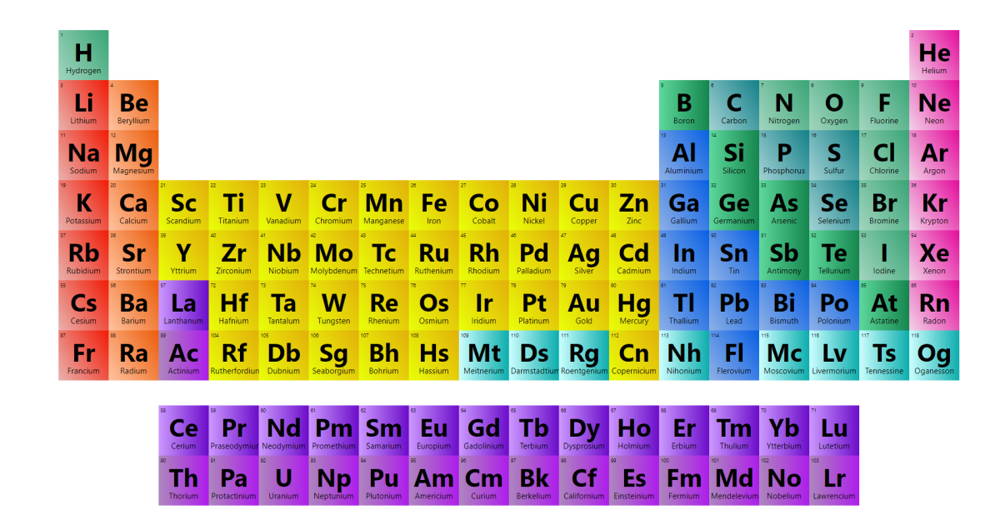

# The Periodic Table of Elements

Made with CSS Grid, React and Science! [See it in Action: PeriodicTable.website](https://periodictable.website)

## Running it on your computer

You will need Node.js installed on your computer. Follow this tutorial to [setup a local development environment with Node and Git bash](https://tamalweb.com/setup-local-dev-environment)

### Clone the repository into your computer

```sh
git clone https://github.com/tamalchowdhury/periodic-table.git
```

Go into the new directory:

```sh
cd periodic-table
```

Install the dependencies with `yarn` or `npm`

```sh
yarn
```

Run the app locally by running `yarn start` or `npm start`

```sh
yarn start
```

Visit http://localhost:3000



## How it was made?

I made the layout using CSS grid. The table is a bunch of boxes in 18 columns, arranged in a funny way.

I used viewport width to set most of the element dimensions, text sizes, so that the table will scale according to screen sizes. Still, please test it on your end and send me a PR.

I created each box with a `<div>` with a class of `element` and number like: `element-1`

I used emmet to auto populate 118 boxes.

The unique class names helped me arrange them by position in CSS. For example in Element 57 and 89 when the Lathanides and Actinoids split the table, I made them seperate and pushed down the markup. See the main css file on how I did it.

After I arranged the elements the way it is, I then transitioned over React.

React allowed me to make the items interactive. I found [a handy JSON](https://github.com/Bowserinator/Periodic-Table-JSON) that had all the element info which I used to dynamically populate the symbol names and other information. This saved me a lot of time and error making this table.

You can read the detailed blog Post here: [How I made The Periodic Table with CSS Grid and React](https://tamalweb.com/periodic-table-reactjs)